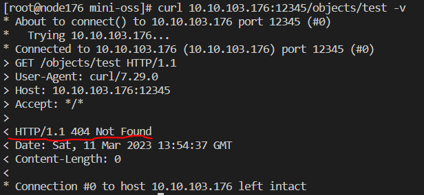
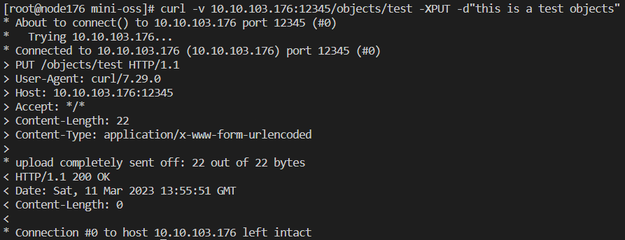
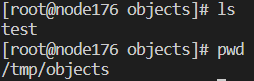
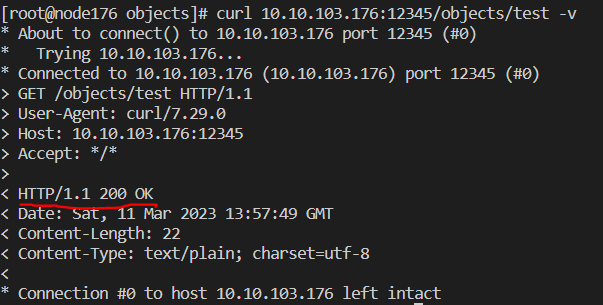

#### 实现一个单机版本的对象存储

1. 支持get和put操作
2. 展示如下：
   1. 启动服务器：LISTEN_ADDRESS=:12345 STORAGE_ROOT=/tmp go run server.go
   2. 通过curl模拟客户端操作：
      1. get操作：curl 10.10.103.176:12345/objects/test -v

         
      2. put操作：curl -v 10.10.103.176:12345/objects/test -XPUT -d"this is a test objects"

         
      3. 观察存储位置：/tmp/objects/

         
      4. 再一次get

         
